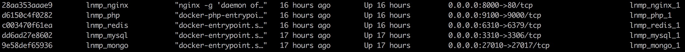

# docker

<!-- TOC -->

- [docker](#docker)
  - [一、使用](#%E4%B8%80%E4%BD%BF%E7%94%A8)
  - [二、php](#%E4%BA%8Cphp)
  - [三、nginx](#%E4%B8%89nginx)
  - [四、mysql](#%E5%9B%9Bmysql)
  - [五、redis](#%E4%BA%94redis)
  - [六、mongo](#%E5%85%ADmongo)
  - [七、查看日志](#%E4%B8%83%E6%9F%A5%E7%9C%8B%E6%97%A5%E5%BF%97)
  - [八、总结](#%E5%85%AB%E6%80%BB%E7%BB%93)
  - [九、参考](#%E4%B9%9D%E5%8F%82%E8%80%83)

<!-- /TOC -->

- [简明docker教程](./简明docker教程.md)
- [docker搭建lnmp环境](./docker搭建lnmp环境.md)

## 一、使用

```bash
# 安装
git clone https://github.com/OMGZui/lnmp.git

# 按需要修改.env
WORKER_DIR=
DATA_PATH=

# 启动
docker-compose up -d php nginx mysql redis mongo

```



## 二、php

```bash
telnet 127.0.0.1 9100

```

## 三、nginx

```bash
# 在工作目录WORKER_DIR里
echo "<?php phpinfo();" > index.php
浏览器打开 127.0.0.1:8000

```

## 四、mysql

```bash
➜  lnmp git:(master) ✗ mysql -h 127.0.0.1 -P 3310 -u root -p
Enter password:
Welcome to the MySQL monitor.  Commands end with ; or \g.
Your MySQL connection id is 1
Server version: 5.5.62 MySQL Community Server (GPL)

Copyright (c) 2000, 2018, Oracle and/or its affiliates. All rights reserved.

Oracle is a registered trademark of Oracle Corporation and/or its
affiliates. Other names may be trademarks of their respective
owners.

Type 'help;' or '\h' for help. Type '\c' to clear the current input statement.

mysql> exit
Bye
```

## 五、redis

```bash
➜  lnmp git:(master) ✗ redis-cli -h 127.0.0.1 -p 6310
127.0.0.1:6310> auth root
OK
127.0.0.1:6310> ping
PONG

➜  lnmp git:(master) ✗ redis-cli -h 127.0.0.1 -p 6310 -a root
Warning: Using a password with '-a' or '-u' option on the command line interface may not be safe.
127.0.0.1:6310> ping
PONG
```

## 六、mongo

```bash
➜  lnmp git:(master) ✗ mongo 127.0.0.1:27010/admin -u root -p
MongoDB shell version v4.0.4
Enter password:
connecting to: mongodb://127.0.0.1:27010/admin
Implicit session: session { "id" : UUID("f0f210ce-a0a7-42e0-8d08-4ce7105dd10d") }
MongoDB server version: 4.0.5
---
Enable MongoDB's free cloud-based monitoring service, which will then receive and display
metrics about your deployment (disk utilization, CPU, operation statistics, etc).

The monitoring data will be available on a MongoDB website with a unique URL accessible to you
and anyone you share the URL with. MongoDB may use this information to make product
improvements and to suggest MongoDB products and deployment options to you.

To enable free monitoring, run the following command: db.enableFreeMonitoring()
To permanently disable this reminder, run the following command: db.disableFreeMonitoring()
---

> show dbs
admin   0.000GB
config  0.000GB
local   0.000GB
```

## 七、查看日志

不保证一次性成功，需要你自己分析日志

```bash
docker-compose logs php
docker-compose logs nginx
docker-compose logs mysql
docker-compose logs redis
docker-compose logs mongo

```

## 八、总结

之前一直用的是laradock，虽然使用没有毛病，但是一旦出了小毛病，就要命，还是自己实践会比较好，也不是很难，完成了也有一定的成就感，以上

## 九、参考

- [Docker — 从入门到实践](https://docker_practice.gitee.io/)
- [laradock](https://github.com/laradock/laradock)
- [Docker在PHP项目开发环境中的应用](https://avnpc.com/pages/build-php-develop-env-by-docker)